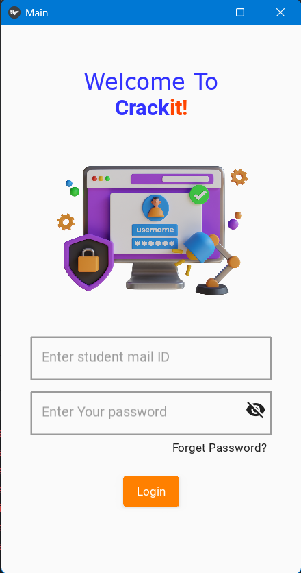
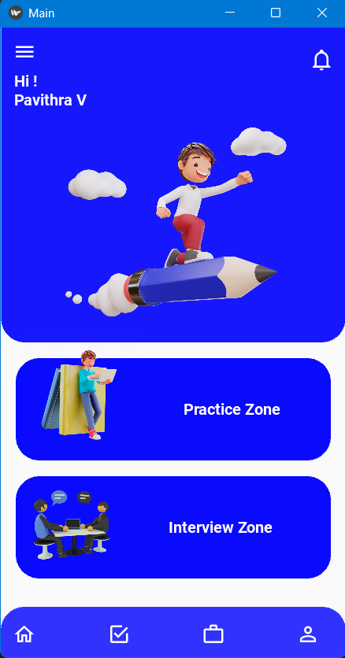
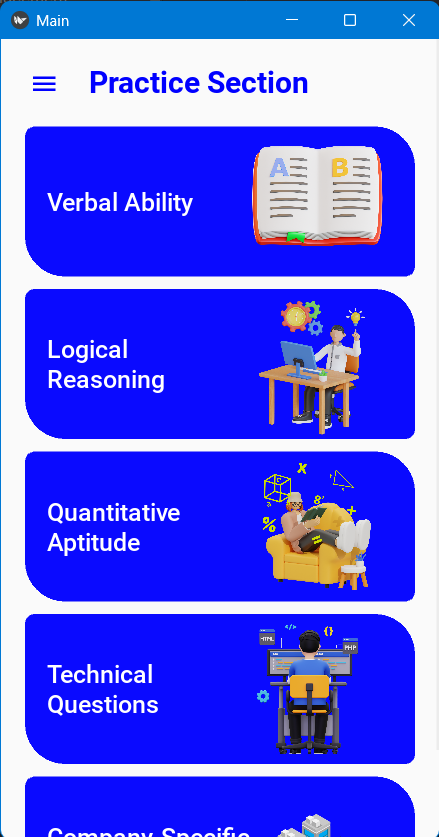
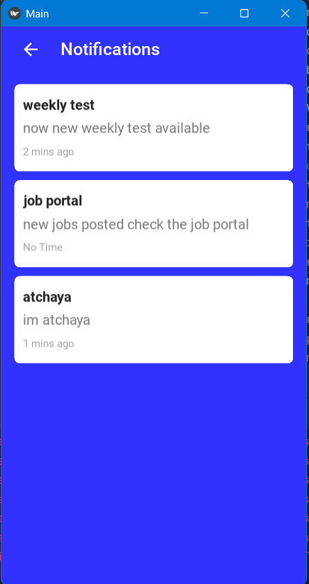
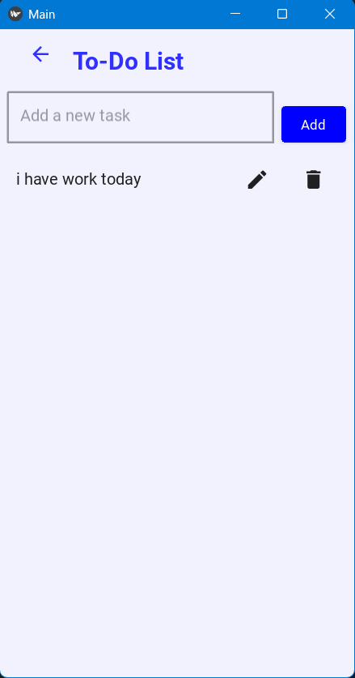
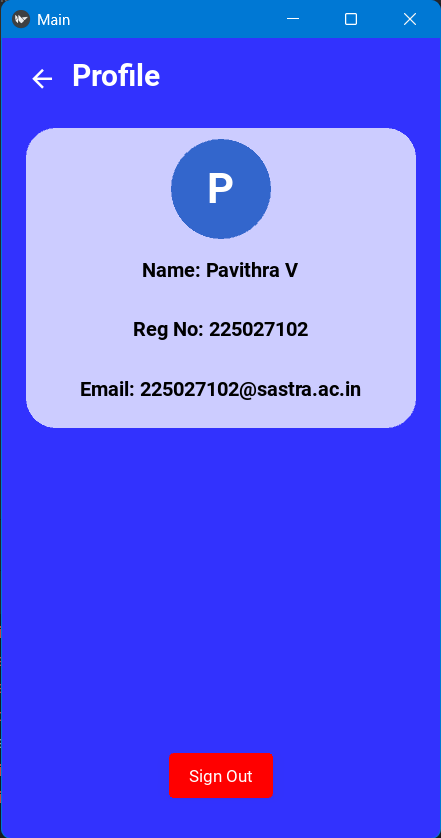

# Crackit

## Placement & Interview Preparation Application

Crackit is a student-focused application designed to help users prepare for placements, internships, aptitude tests, technical interviews, and HR interviews in one place.

## Features

* Aptitude practice
* Quantitative aptitude questions
* Logical reasoning practice
* Verbal ability practice
* Technical interview preparation
* HR interview questions
* Company-specific preparation
* Mock tests
* Interview tips
* Practice questions
* Firebase-based data management
* User profile and application features

## Technologies Used

* **Python**
* **Kivy**
* **KivyMD**
* **Firebase Realtime Database**
* **PyCharm**
* **Git & GitHub**

## Project Structure

The project is organized into separate Python modules for different sections of the application, including:

* Home
* Practice
* Aptitude
* Logical Reasoning
* Verbal Ability
* Technical Preparation
* HR Questions
* Interview Tips
* Company Practice
* Mock Tests
* User Profile

## How to Run

### 1. Clone the repository

```bash
git clone https://github.com/YOUR-USERNAME/Placify.git
cd Placify
```

### 2. Create a virtual environment

```bash
python -m venv .venv
```

### 3. Activate the virtual environment

Windows:

```bash
.venv\Scripts\activate
```

### 4. Install dependencies

Install the required Python packages used by the project.

For example:

```bash
pip install kivy kivymd firebase-admin
```

### 5. Configure Firebase

This project uses Firebase for data storage.

The Firebase service-account credentials are intentionally **not included in this repository for security reasons**.

You will need to configure your own Firebase credentials before running the Firebase-dependent features.

### 6. Run the application

```bash
python main.py
```

## Screenshots
Screenshots of the application can be added here to demonstrate the user interface and major features.

### Login Page


### Home Page


### Practice Section


### Test Results


### Notifications


### To-Do List


### Profile



## Future Improvements

* Improve UI/UX
* Add more placement preparation content
* Add progress tracking
* Add more company-specific preparation
* Improve authentication and security
* Add deployment support
* Add analytics and personalized preparation recommendations

## Developer

**Pavithra**

Built as a project focused on helping students prepare for placement and internship opportunities.

## Note

This project is intended for educational and portfolio purposes.
